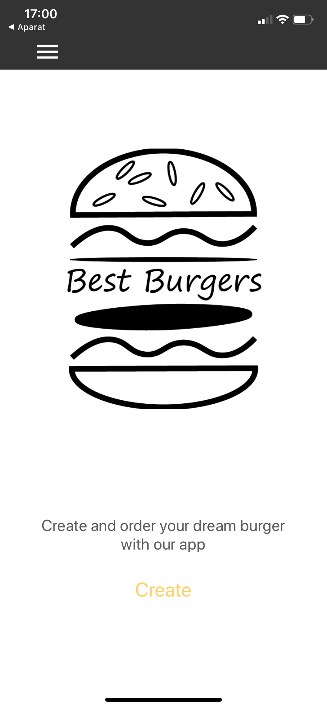
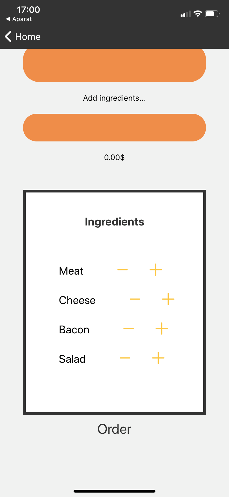
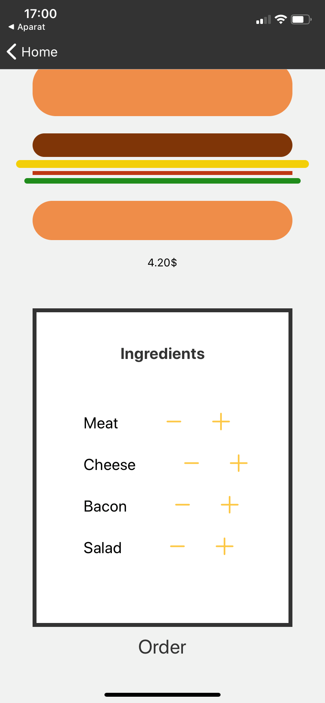
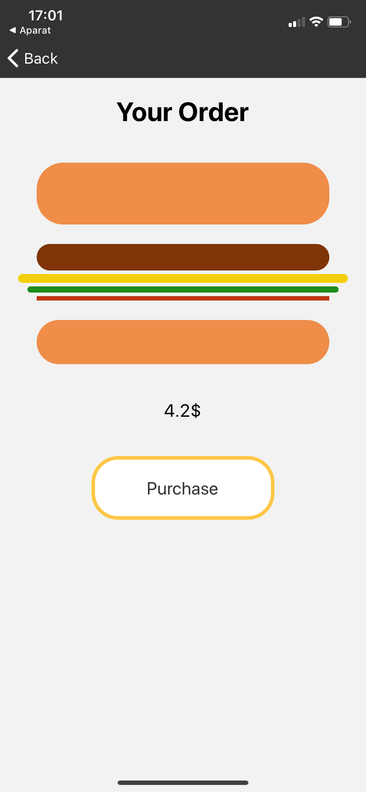
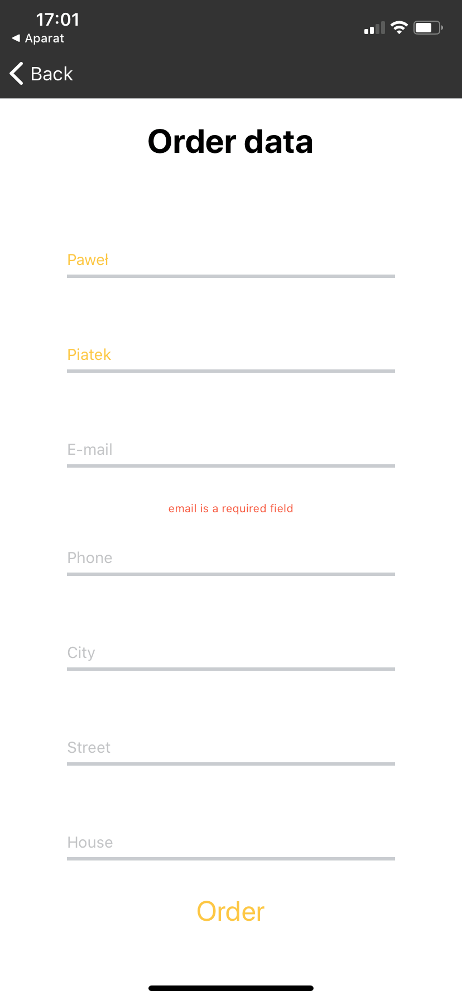
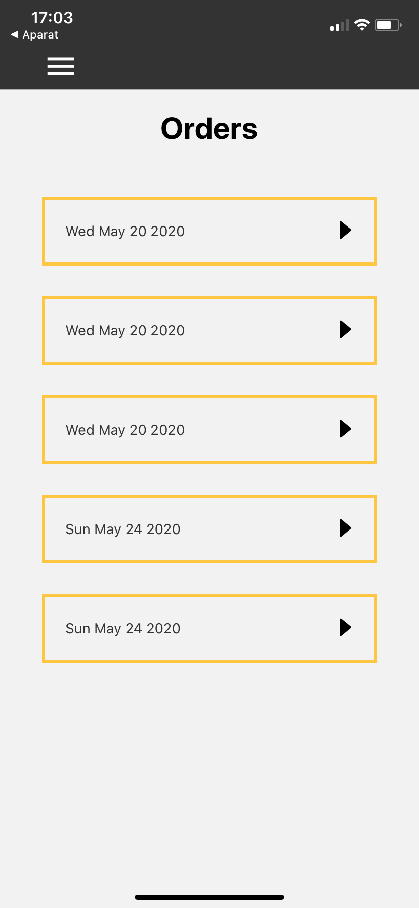
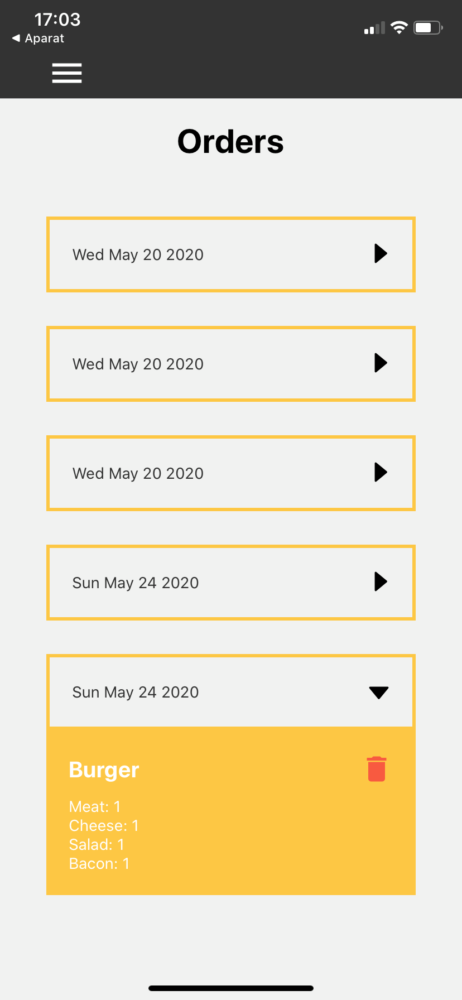
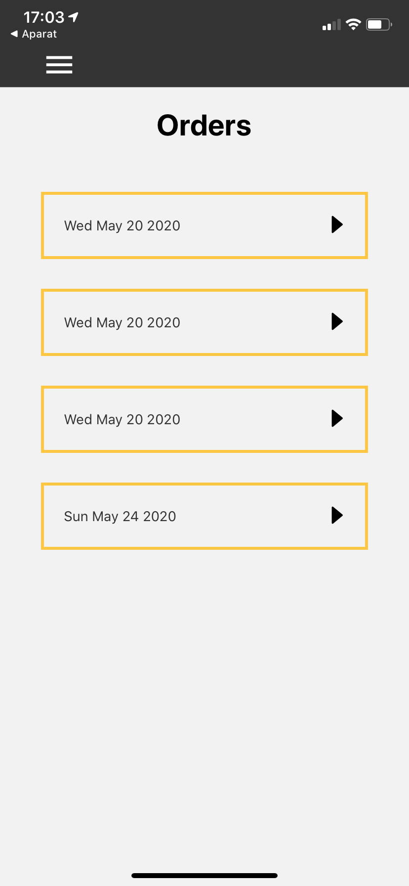

<!-- AUTO-GENERATED-CONTENT:START (STARTER) -->

<h2 align="center">
 Covid-19 tracker
</h2>

***

<h4>Demo screenshots</h4>



















<h4>Project description</h4>


This project is a React Native application. This app uses styled components for styling. 
For managing state and async actions I used react hooks (useState, useEffect).
Data are stored in Firebase real time database

 Application's logic is divided into several files. App.js is a root file. Another 
 components are nested in this component.
 
User can create and order burger. User can also show list of all ordered burgers.


***
<h4>Technologies</h4>

1. React Native
2. Styled Components
3. Firebase 

***
<h4>Develop project</h4>

1. **Download expo app from store or install Android or IOS simulator.**
2.  **Start developing.**


    Navigate into your new site’s directory and start it up.

    ```shell
    cd covid19/
    npm start
    ```

1.  **Open the source code and start editing**

    App is now running at `http://localhost/`
    
2. Launch the open tab in the browser   
3. When you are using expo app on your mobile device: Scan QR code with your device
4. When you are using simulator: Choose proper simulator button.

    
    
  ***

<h4>Project structure</h4>

A quick look at the top-level files and directories you'll see in a Gatsby project.

        ├── .expo   
        ├── .expo-shared   
        ├── assets
            ├── readmeImages
            ├── burger-logo.png
            ├── icon.png
            ├── logo.png
            ├── styles
            ├── splash.png
            ├── variables.js
        ├── components
            ├── burgerIngredients.js
            ├── burgerIngredientsButtons.js
            ├── burgerSummary.js
            ├── button.js
            ├── contactDataSummary.js
            ├── ingredients.js
            ├── order.js
            ├── orderForm.js
            ├── spinner.js
            ├── textButton.js
        ├── node_modules
        ├── routes
            ├── drawer.js
            ├── homeStack.js
            ├── ordersStack.js
        ├── screens
            ├── burgerBuilder.js
            ├── home.js
            ├── order.js
            ├── orderConfirm.js
            ├── orderData.js
            ├── orders.js
            ├── orderSummary.js
        ├── shared
            ├── header.js
        ├── styles
            ├── globalStyle.js
        ├── .gitignore
        ├── App.js
        ├── app.jason
        ├── babel.config.js
        ├── firebase.js
        ├── package.jason
        ├── package-lock.jason
        ├── README.md
        
 
 


<!-- AUTO-GENERATED-CONTENT:END -->
